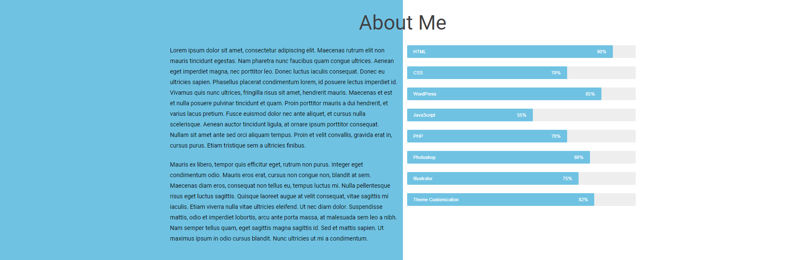

# Personal Portfolio 🔥
> https://imamulkadir.github.io/

:star: Star me on GitHub — it helps!

### Website Preview
#### Home Section

 
  <kbd>
    
  </kbd>

#### About Section

 
  <kbd>
    
  </kbd>

#### Services Section

 
  <kbd>
    
  </kbd>

#### Footer Section

 
  <kbd>
    
  </kbd>

#### Contact Form (pop up)

 
  <kbd>
    
  </kbd>

:star: Star me on GitHub — it helps!

## Features 📋
⚡️ Fully Responsive\
⚡️ Wordpress\
⚡️ Elemantor\
⚡️ Ocean-wp Theme

## Installation & Deployment 📦
- Install `XAMPP`
- Copy and Paste the content to `xampp/htdocs/wp_portfolio`
- Start xamp and run `Apache` & `MySQL` server
- Creat a database named `wp` in phpmyadmin and set connection
- Head to localhos/wp_portfolio

## Sections 📚
✔️ Home\
✔️ About\
✔️ Services\
✔️ Contact Info\

## Tools Used 🛠️
* <b>Worpress</b> || <b>XAMPP</b> || <b>VSCode</b>

